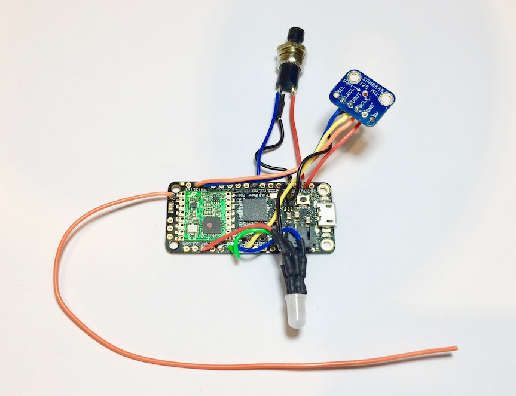

# Sound System - Hardware
This repository is part of a larger project which brings together Raspberry PI's, SDStore, Arduino style microcontrollers, Smart phones, BLE and RFM69 radios, to create a sound level monitoring local area sensor network. In this repository you will find microcontroller code for both testing and deployment network nodes. For more information see kittley.com.

## Nodes
Below are links to the various hardware setups and their respective readme files.

* [Sensor Node Version 1](sensors/)
* [RFM69 to BLE Node](rfm69_ble/)
* [Node test code](for_testing/)
* [Code used for Lab Study in Paper](labStudy/)

## Example Node

