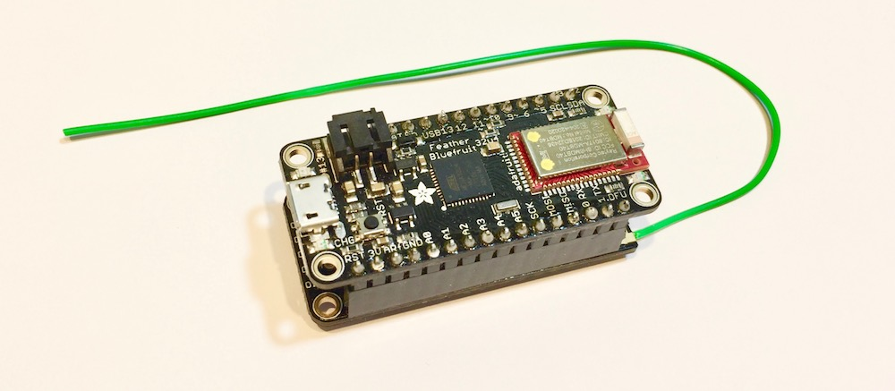

# Sound System
As part of the system architecture it is necessary for a smartphone / tablet application to inspect the data outputted by individual nodes. As RFM69 radios are not currently integrated into smart phones it was necessary to develop an interfacing node to act as a relay, passing packets from the RFM69 to the smart phone via BLE and returning messages in the same manner. 

## Wiring
Solder on and Antenna (16.4cm for 433Mhz) and the header pins and plugin the wing. 

## Components
We used the components listed below. 

* [Adafruit Bluefruit LE M0](https://www.adafruit.com/product/2995)
* [Adafruit RFM69 Wing](https://www.adafruit.com/product/3230)

## Software
Before using the Arduino IDE upload the file `relay.ino` to you board. Check that you have the following dependencies installed:

* Coming soon

## Example Node
