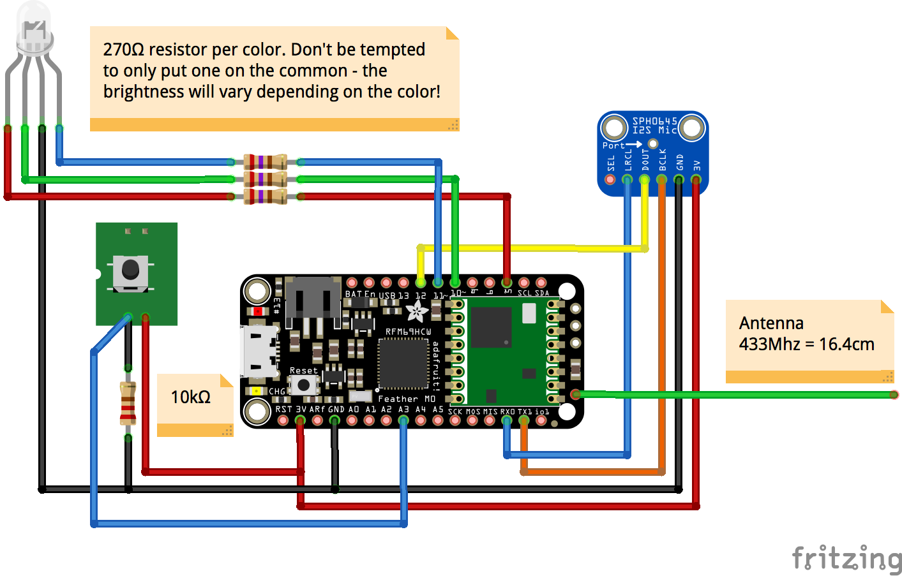

# Sound System - Node V1
This folder contains the code for the first version of the Sound System sensor node.

## Wiring
The node hardware should be wired as follows. 

## Components
We used the components listed below. If you make changes then make sure the code reflects any wiring alterations and be sure the resistor match

* [Adafruit RFM69 M0](https://www.adafruit.com/product/3177)
* [Adafruit I2S MEMS Microphone SPH0645LM4H](https://www.adafruit.com/product/3421) 
* Any push to make switch
* [Diffused RGB (tri-color) 10mm LED](https://www.adafruit.com/product/848)
* 3x 270Ω Resistor for LED
* 1x 10kΩ Resistor for switch

## Software
Before using the Arduino IDE upload the file `v1.ino` to you board. Check that you have the following dependencies installed:

* Coming soon

## Example Node
